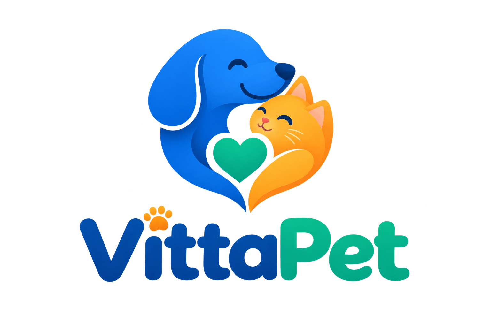

# 🐾 VittaPet

> Gestão inteligente de saúde preventiva e adoção responsável de pets.

## 👥 Integrantes

- **Gabrielly Lorentz — RM 565806**
- **Giovanna Praieiro — RM 565681**
- **Heitor Fernandes — RM 563078**
- **Júlia Aparicio — RM 563623**
- **Maria Eduarda de Oliveira — RM 565386**
- **Nicolle Calasans — RM 564381**

## 🎯 Proposta de Valor

Facilitar o cuidado preventivo de cães e gatos por meio da centralização de informações de saúde, lembretes de cuidados e vacinação, além de promover a adoção responsável.

O VittaPet busca transformar o cuidado com os animais em uma experiência mais simples, preventiva e organizada, contribuindo para uma vida longa e saudável dos pets.

## 🚀 Funcionalidades (MVP)

- **Gestão de Perfis de Pets:** cadastro detalhado do animal, incluindo nome, espécie, raça, porte, idade e foto.
- **Painel Inteligente de Lembretes:** organização de cuidados preventivos, como vacinas, vermífugos e antipulgas.
- **Carteirinha Digital de Vacinação:** registro do histórico médico e das imunizações do pet.
- **Espaço de Adoção Responsável:** divulgação de animais disponíveis para adoção e conexão com a instituição responsável.

## 🎯 Público-Alvo

- Tutores de cães e gatos com rotinas atarefadas.
- Tutores de primeira viagem.
- ONGs e protetores independentes.

## 🏷️ Marca

### Naming

O nome **VittaPet** combina a ideia de *vita*, associada à vida, vitalidade e longevidade, com o termo *pet*, utilizado para representar animais de estimação. A combinação transmite o propósito da aplicação de contribuir para o cuidado, a saúde e o bem-estar dos animais ao longo de suas vidas.

### Tom de Voz

- **Acolhedor e empático:** estabelece uma relação de proximidade com os tutores e reconhece o vínculo afetivo com os animais.
- **Preventivo e confiável:** apresenta informações e lembretes de saúde de forma clara e responsável.
- **Claro e direto:** utiliza uma comunicação simples e objetiva, facilitando a compreensão das informações e ações necessárias.

## 🎨 Identidade Visual

### Logotipo



O logotipo representa a união entre cuidado, afeto e bem-estar animal. A composição com cão e gato, o coração central e a combinação das cores reforçam a proposta acolhedora e preventiva do VittaPet.

### Paleta de Cores

| Elemento | Código HEX | Aplicação |
|---|---|---|
| Primary Blue | `#3B82F6` | Botões principais, navegação, cabeçalhos e elementos de destaque |
| Secondary Green | `#10B981` | Indicadores positivos e confirmações |
| Accent Orange | `#F59E0B` | Alertas e ações que exigem atenção |
| Background Grey | `#F9FAFB` | Fundo da aplicação e áreas de conteúdo |

### Tipografia

A identidade visual do VittaPet utiliza a família tipográfica **Nunito**.

- **Nunito Bold:** títulos e elementos de maior destaque.
- **Nunito SemiBold:** subtítulos, botões e informações importantes.
- **Nunito Regular:** textos, descrições e informações gerais.

A Nunito foi escolhida por sua boa legibilidade e pelas formas arredondadas, que reforçam a proposta acolhedora, amigável e confiável do VittaPet.

## 💡 Proposta de Venda

### Pitch

> O VittaPet é a plataforma integrada que transforma o cuidado pet em uma experiência simples, preventiva e sem esquecimentos. Conectamos o acompanhamento médico completo do animal a um ecossistema consciente de adoção responsável, garantindo que todo pet tenha uma vida longa, saudável e cercada de carinho desde o primeiro dia.

### Diferencial Competitivo

- **Abordagem Preventiva Integrada:** foco no ciclo de imunização e na saúde preventiva contínua.
- **Ponte com o Ecossistema de Adoção:** conexão entre adoção responsável e acompanhamento dos cuidados do animal.
- **Praticidade Mobile First:** proposta de interface simplificada, com cards claros e navegação fluida.

### Modelo de Negócio

**Modelo Freemium:** acesso gratuito às ferramentas essenciais de perfil, lembretes e adoção, com possibilidade de recursos premium para gestão ilimitada de múltiplos pets, backup em nuvem e exportação de relatórios.

**Parcerias com Clínicas e Pet Centers:** possibilidade de parcerias com clínicas veterinárias, pet centers e marcas relacionadas à saúde e ao bem-estar animal.

## 🛠️ Tecnologias

- **Framework:** Flutter (Dart)
- **Controle de versão:** Git e GitHub

## ▶️ Como Executar o Projeto

### Pré-requisito

É necessário ter o Flutter instalado e configurado no ambiente de desenvolvimento.

### Passo a passo

```bash
git clone https://github.com/heitorfernandesbarbosa/VittaPetApp.git
cd VittaPetApp
flutter pub get
flutter run
```

## 👨‍💻 Responsabilidades dos Integrantes

- **Gabrielly Lorentz:** pesquisa e documentação do problema e público-alvo, contribuindo para a estruturação da documentação inicial do projeto.
- **Giovanna Praieiro:** organização e revisão da documentação, definição e detalhamento das funcionalidades do MVP e apoio no desenvolvimento inicial da aplicação em Flutter.
- **Heitor Fernandes:** criação e configuração inicial do projeto Flutter, estruturação do projeto, desenvolvimento da tela inicial e organização do repositório GitHub.
- **Julia Aparicio:** estruturação da proposta de valor, diferencial competitivo, pitch e informações relacionadas ao modelo de negócio.
- **Maria Eduarda de Oliveira:** desenvolvimento da identidade visual, definição da aplicação da paleta de cores e tipografia e apoio na organização visual da interface inicial.
- **Nicolle Calasans:** revisão e validação da documentação, conferência da coerência entre proposta, público-alvo e funcionalidades e apoio na validação final dos requisitos do projeto.

## 📌 Checkpoint 4

O Checkpoint 4 corresponde à etapa de **Idealização do App**, contemplando a definição do problema, público-alvo, funcionalidades do MVP, desenvolvimento da marca, identidade visual, proposta de venda, diferencial competitivo e modelo de negócio.

O projeto será evoluído nos próximos checkpoints.
